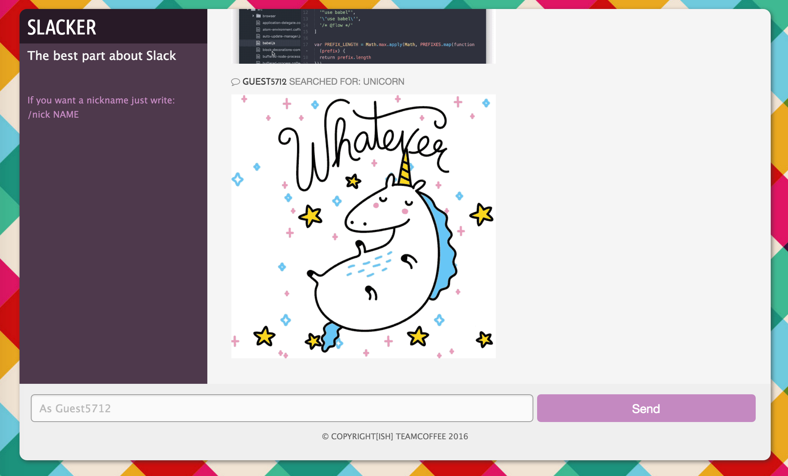

# Slacker

## What?
It's a realtime messaging app in which you can only talk with gifs. It leverages WebSocket and the Giphy API.

## Why?
This app comes from a short hackathon (10~ hours) at General Assembly WDI. The point was to build something cool without thinking to much about what the code looked like.

I had wanted to work with websocket for a bit and so a messaging app seemed to be the logical choice, the giphy plugin for slack was a big hit with our class, so we thought: "What if you could only communicate with gif?".

 The basic functionality was build in a few hours and we just spent the rest of the day adding things we thought were funny (/nick functionality, posting gif with a url, storing history in a json file...).

## Where?
There is hosted version [here](slacker.do.timdeve.com).